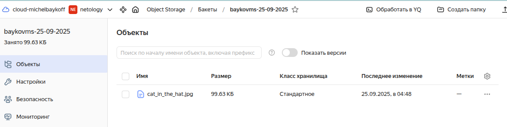
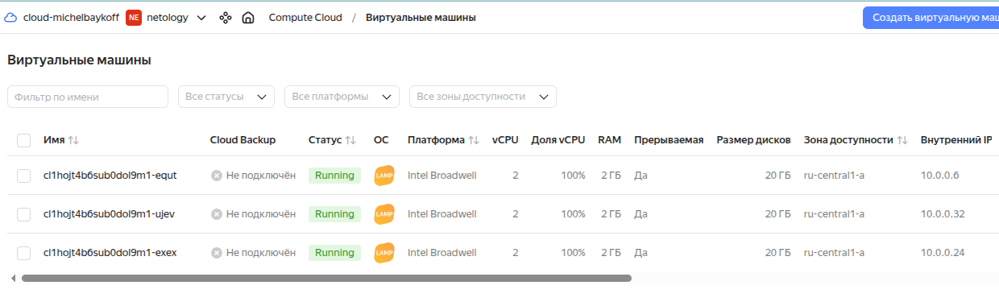
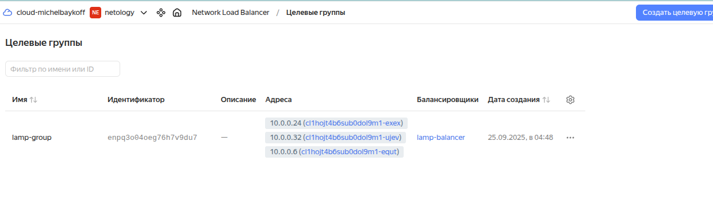
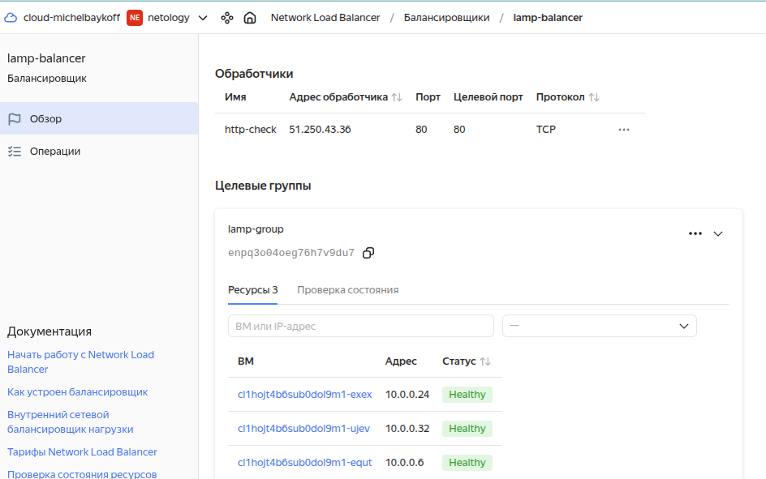
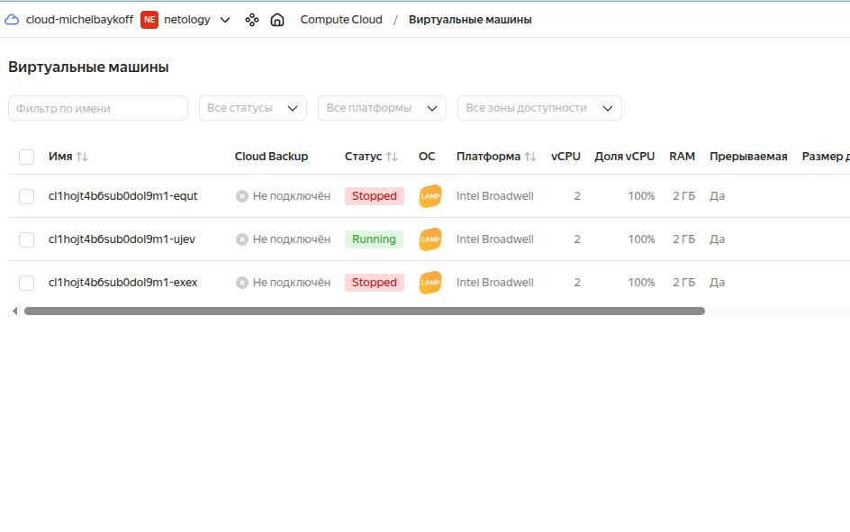

# Домашнее задание к занятию «Вычислительные мощности. Балансировщики нагрузки»  -- Байков Михаил

## Задание 1. Yandex Cloud 

**Что нужно сделать**

1. Создать бакет Object Storage и разместить в нём файл с картинкой:

 - Создать бакет в Object Storage с произвольным именем (например, _имя_студента_дата_).
 - Положить в бакет файл с картинкой.
 - Сделать файл доступным из интернета.
 
2. Создать группу ВМ в public подсети фиксированного размера с шаблоном LAMP и веб-страницей, содержащей ссылку на картинку из бакета:

 - Создать Instance Group с тремя ВМ и шаблоном LAMP. Для LAMP рекомендуется использовать `image_id = fd827b91d99psvq5fjit`.
 - Для создания стартовой веб-страницы рекомендуется использовать раздел `user_data` в [meta_data](https://cloud.yandex.ru/docs/compute/concepts/vm-metadata).
 - Разместить в стартовой веб-странице шаблонной ВМ ссылку на картинку из бакета.
 - Настроить проверку состояния ВМ.
 
3. Подключить группу к сетевому балансировщику:

 - Создать сетевой балансировщик.
 - Проверить работоспособность, удалив одну или несколько ВМ.

## Решение 1.

1. Пишем код для создания S3 хранилища, назначаем права на чтение всем и размещаем в нем файл. Применяем и проверяем, что файл доступен.  
Код: [object_storage.tf](terraform/object_storage.tf)  

2. Создаем группу ВМ в подсети public из прошлого задания. В качестве шаблона используем образ LAMP с `image_id = fd827b91d99psvq5fjit`. Применяем и проверяем, что группа ВМ успешно создалась.  
Код: [groupvm.tf](terraform/groupvm.tf)  

3. Пишем код для балансировщика и подключаем созданную в предыдущем пункте группу ВМ к балансировщику.  
Код: [balancer.tf](terraform/balancer.tf)  

  - Проверяем работоспособность балансера отключив две машины из трех. Тестовая страница доступна по адресу балансировщика. 
  
  